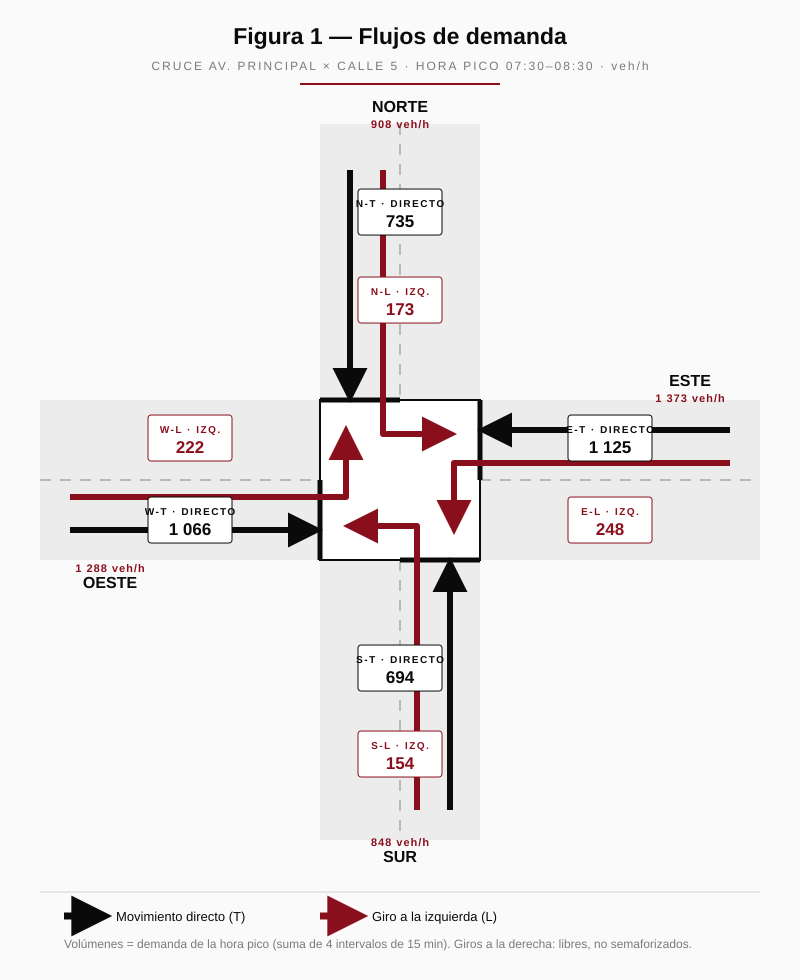
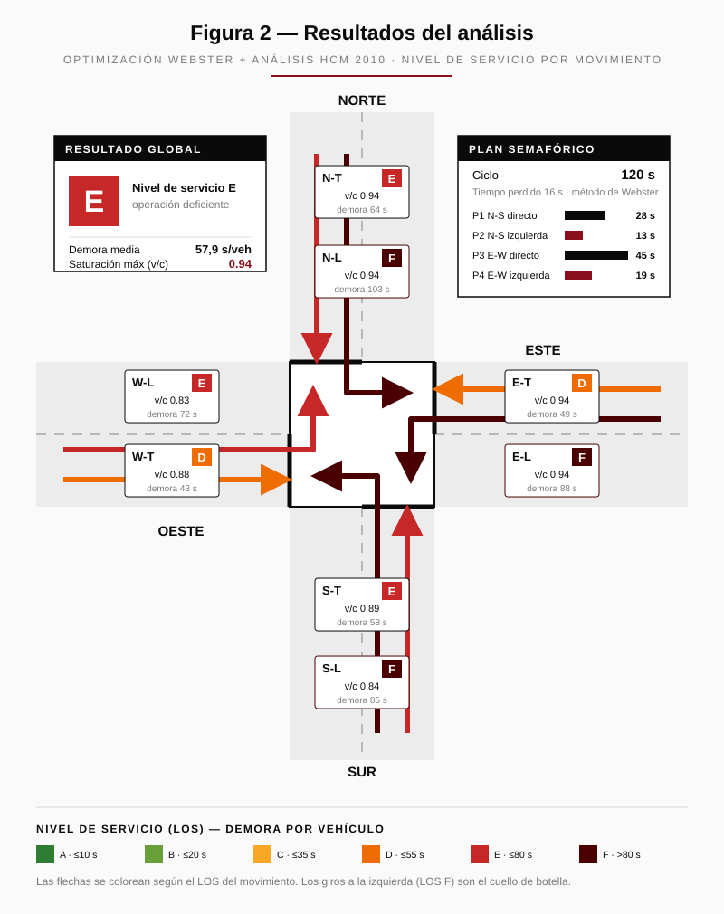

# Instructivo paso a paso — Carga de datos

Guía para cargar una intersección en **Traffic Intersection Optimizer** y
obtener el plan de tiempos de semáforo, el análisis de tránsito y la
simulación.

> Esta guía cubre la pestaña **01 · Configuración**, donde se ingresan todos
> los datos. Las pestañas 02 a 05 muestran los resultados y análisis.

---

## 1. Antes de empezar

1. El **backend** debe estar corriendo (`python run.py` en la carpeta
   `backend/`). Eligió un puerto libre automáticamente.
2. El **frontend** debe estar corriendo (`npm run dev` en `frontend/`).
3. Abre el navegador en **http://localhost:5173**.

Si ves la barra superior con el título *Traffic Intersection Optimizer* y
cinco pestañas, estás listo.

---

## 2. Conceptos clave (glosario)

Lee esto una vez; te ahorrará dudas más adelante.

| Término | Qué es |
|---|---|
| **Acceso** (approach) | Cada vía por la que los vehículos *llegan* a la intersección. Ej.: Norte, Sur, Este, Oeste. |
| **Grupo de carriles** (lane group) | Conjunto de carriles de un acceso que comparten un mismo movimiento. Ej.: "los 2 carriles centrales que siguen de frente". |
| **Movimiento** | Hacia dónde va el grupo: `through` (directo), `left` (giro izquierda), `right` (giro derecha). |
| **Fase** | Combinación de grupos que reciben **verde al mismo tiempo**. Un ciclo de semáforo se divide en varias fases. |
| **Demanda** | Cuántos vehículos por hora quieren usar cada grupo de carriles (veh/h). |
| **Flujo de saturación** | Cuántos vehículos por hora puede descargar **un carril** con verde continuo. Valor típico: **1900 veh/h/carril**. |
| **PHF** (Peak Hour Factor) | Factor de hora pico: corrige picos de 15 min dentro de la hora. Típico **0.90–0.95**. |
| **PCU** | Equivalente a vehículo ligero. Autos = 1.0; con muchos camiones/buses, sube (1.2–2.0). |
| **Coordenadas** | Latitud y longitud de la intersección, para ubicarla en el plano de la ciudad. |

---

## 3. Visión general del flujo de carga

El orden recomendado es **siempre el mismo**:

```
  [1] Datos generales (nombre, PHF) + UBICACIÓN (coordenadas)
        │
        ▼
  [2] Geometría: crear ACCESOS
        │
        ▼
  [3] Geometría: crear GRUPOS DE CARRILES en cada acceso
        │
        ▼
  [4] Crear FASES del semáforo
        │
        ▼
  [5] Asignar cada grupo de carriles a su(s) FASE(S)
        │
        ▼
  [6] Cargar la DEMANDA (veh/h) de cada grupo
        │
        ▼
  [7] Revisar  →  [8] Optimizar y analizar
```

> **Importante:** no se puede asignar un grupo a una fase si el grupo aún no
> existe. Por eso primero la geometría, después las fases.

---

## 4. PASO 1 — Elegir punto de partida

Tienes dos opciones en la barra superior:

- **Cargar ejemplo** → rellena una intersección de 4 ramas ya completa.
  Recomendado la primera vez: explóralo, modifícalo y aprende.
- **Empezar en blanco** → si la app abre vacía, empiezas desde cero.

> Consejo: para tu primera intersección real, carga el ejemplo, revisa cómo
> está armado y luego bórralo/edítalo para adaptarlo a tu caso.

Asegúrate de estar en la pestaña **01 · Configuración**.

---

## 5. PASO 2 — Datos generales y ubicación

### Ubicación (mapa)

La primera tarjeta de la pestaña, **Ubicación**, sitúa la intersección en el
plano de la ciudad:

1. Ingresa la **Latitud** y la **Longitud**, o usa el campo
   *«pegar latitud, longitud»* para cargar ambas de una vez. En Google Maps:
   clic derecho sobre el punto → las coordenadas aparecen arriba del menú,
   cópialas y pégalas.
2. Con coordenadas válidas aparece un **mapa** con un marcador sobre la
   intersección, y un enlace para abrirla en OpenStreetMap.

> La ubicación es opcional para el cálculo, pero recomendable: documenta el
> sitio y se incluye al **Exportar JSON** y en el informe del caso.

### Nombre y PHF

En la tarjeta **Geometría de la intersección**, arriba:

1. **Nombre** — escribe un nombre identificable.
   Ej.: `Av. Principal x Calle 5 — hora pico AM`.
2. **PHF** — factor de hora pico. Si no lo conoces, deja **0.92**.

---

## 6. PASO 3 — Crear los accesos

Un **acceso** por cada dirección desde la que llegan vehículos.

1. Pulsa **+ Acceso**. Aparece una fila nueva.
2. Completa:
   - **ID** — código corto y único. Ej.: `N`, `S`, `E`, `W`.
   - **Nombre** — descriptivo. Ej.: `Norte`, `Av. Libertador (sentido sur)`.
3. Repite **+ Acceso** hasta tener todos los accesos.

> Una intersección típica en cruz tiene **4 accesos**. Una "T" tiene **3**.
> El sistema admite cualquier número.

Para borrar un acceso mal creado: botón **Eliminar acceso** (rojo) en esa fila.

---

## 7. PASO 4 — Crear los grupos de carriles

Para **cada acceso**, define cómo se reparten sus carriles por movimiento.

Dentro del acceso verás una tabla. Pulsa **+ Grupo de carriles** por cada
grupo y completa las columnas:

| Columna | Qué poner |
|---|---|
| **ID** | Código único. Convención útil: `<acceso>-<movimiento>`. Ej.: `N-T` (Norte directo), `N-L` (Norte izquierda). |
| **Movimiento** | `through`, `left` o `right`. |
| **Carriles** | Cuántos carriles físicos tiene ese grupo. |
| **Sat. (veh/h/c)** | Flujo de saturación por carril. Deja **1900** salvo que tengas un valor medido. |
| **Compartido** | Marca la casilla **solo** si un carril de giro comparte con el directo (reduce capacidad). |

### Ejemplo de un acceso

Acceso **Norte** con 2 carriles directos + 1 carril exclusivo de izquierda:

| ID | Movimiento | Carriles | Sat. | Compartido |
|---|---|---|---|---|
| `N-T` | through | 2 | 1900 | ☐ |
| `N-L` | left | 1 | 1900 | ☐ |

> Si el giro a la derecha es libre (sin semáforo), **no lo cargues** como
> grupo: no consume tiempo de verde.

Repite para **todos** los accesos antes de pasar a las fases.

---

## 8. PASO 5 — Crear las fases del semáforo

Baja a la tarjeta **Fases del semáforo**.

Una **fase** = los movimientos que tienen verde a la vez. Diseña las fases
para que **no haya conflictos** (dos corrientes que se crucen no pueden
tener verde juntas).

1. Pulsa **+ Fase**.
2. Completa los campos de la fila:

| Campo | Significado | Valor típico |
|---|---|---|
| **ID** | Código único. Ej.: `P1`, `P2`. | — |
| **Nombre** | Descriptivo. Ej.: `N-S directo`. | — |
| **Min g** | Verde mínimo (s). | 7 |
| **Max g** | Verde máximo (s). | 60 (25 para fases de giro) |
| **Y** | Amarillo (s). | 3 |
| **AR** | Todo-rojo de despeje (s). | 1 |

### Esquema de fases típico (intersección en cruz con giros)

```
  P1 — N-S directo      (los directos Norte y Sur)
  P2 — N-S izquierda    (los giros izquierda Norte y Sur)
  P3 — E-W directo      (los directos Este y Oeste)
  P4 — E-W izquierda    (los giros izquierda Este y Oeste)
```

Si no hay giros izquierda con semáforo, bastan **2 fases** (N-S y E-W).

---

## 9. PASO 6 — Asignar grupos a las fases

Debajo de cada fila de fase hay **casillas con los IDs de todos los grupos
de carriles**. Marca los grupos que deben tener verde en esa fase.

Ejemplo para la fase `P1 — N-S directo`:

```
  ☑ N-T   ☑ S-T   ☐ N-L   ☐ S-L   ☐ E-T   ☐ W-T   ☐ E-L   ☐ W-L
```

> **Regla de oro:** cada grupo de carriles debe estar marcado en **al menos
> una fase**. Si un grupo no está en ninguna fase, nunca recibirá verde y el
> análisis lo marcará como advertencia.

---

## 10. PASO 7 — Cargar la demanda

Baja a la tarjeta **Demanda**. Verás una fila por **cada grupo de carriles**
que creaste (se generan solas). Completa:

| Columna | Qué poner |
|---|---|
| **Demanda (veh/h)** | Vehículos por hora que usan ese grupo en la hora analizada. |
| **PCU** | 1.0 para tráfico de autos. Súbelo si hay muchos camiones/buses. |

Las columnas Acceso / Grupo / Mov. / Carriles son solo informativas (no se
editan; vienen de la geometría).

> ¿De dónde sale la demanda? Ver la **sección 15** (ejemplo con aforos
> reales) o la **sección 16** (cómo estimarla si no tienes aforos).

---

## 11. PASO 8 — Revisar antes de calcular

Checklist rápido:

- [ ] Cada acceso tiene al menos un grupo de carriles.
- [ ] Cada grupo tiene un **ID único** (no se repiten).
- [ ] Cada grupo está marcado en al menos una fase.
- [ ] Las fases no juntan movimientos en conflicto.
- [ ] Toda fila de **Demanda** tiene un valor (0 es válido; vacío no).
- [ ] El **PHF** está entre 0.70 y 1.00.

---

## 12. PASO 9 — Optimizar y analizar

1. Pulsa **Optimizar y analizar** (barra superior, botón oscuro).
2. La app salta a **02 · Tiempos & análisis** y muestra:
   - Comparación de dos optimizadores — Webster (1958) y minimización
     directa de la demora HCM — con el de menor demora resaltado (★) y un
     botón para ver el detalle de cada plan.
   - Ciclo y verde por fase del plan seleccionado.
   - Demora media, nivel de servicio (LOS A–F) y relación v/c.
   - Tabla HCM por movimiento (capacidad, cola, demora).
3. Para ver colas en el tiempo → pestaña **03 · Simulación**: corre N
   réplicas (20 por defecto) y muestra la mediana con banda de percentiles
   5–95 — el rango esperable, no una corrida suelta.
4. Para comparar escenarios de demanda → pestaña **04 · Escenarios**.
5. Para evaluar la intersección **sin semáforo** → pestaña **05 · Sin
   semáforo**: marca qué accesos son la calle principal (sin PARE) y pulsa
   **Analizar y comparar**. Obtienes una comparación entre semáforo y PARE
   en la calle secundaria (HCM cap. 19).

> Si cambias cualquier dato en Configuración, vuelve a pulsar **Optimizar y
> analizar** para refrescar los resultados.

---

## 13. Guardar y reutilizar la configuración

En la barra superior:

- **Exportar JSON** — descarga un archivo `.json` con toda la configuración.
  Úsalo para guardar tu intersección o compartirla.
- **Importar JSON** — vuelve a cargar un archivo exportado antes.

> Recomendación: exporta cada intersección con un nombre claro
> (`cruce-av-principal-AM.json`) y guárdala. Así no hay que recargar a mano.

---

## 14. Ejemplo completo resuelto

Intersección en cruz, 4 accesos, con giros izquierda semaforizados.

**Datos generales**
- Nombre: `Cruce Demo`  ·  PHF: `0.92`

**Accesos y grupos de carriles**

| Acceso | Grupo | Mov. | Carriles | Sat. |
|---|---|---|---|---|
| Norte (`N`) | `N-T` | through | 2 | 1900 |
| Norte (`N`) | `N-L` | left | 1 | 1900 |
| Sur (`S`) | `S-T` | through | 2 | 1900 |
| Sur (`S`) | `S-L` | left | 1 | 1900 |
| Este (`E`) | `E-T` | through | 2 | 1900 |
| Este (`E`) | `E-L` | left | 1 | 1900 |
| Oeste (`W`) | `W-T` | through | 2 | 1900 |
| Oeste (`W`) | `W-L` | left | 1 | 1900 |

**Fases** (Min g 7 · Y 3 · AR 1; Max g 60, salvo giros 25)

| Fase | Nombre | Grupos marcados |
|---|---|---|
| `P1` | N-S directo | `N-T`, `S-T` |
| `P2` | N-S izquierda | `N-L`, `S-L` |
| `P3` | E-W directo | `E-T`, `W-T` |
| `P4` | E-W izquierda | `E-L`, `W-L` |

**Demanda** (PCU = 1.0)

| Grupo | veh/h | | Grupo | veh/h |
|---|---|---|---|---|
| `N-T` | 800 | | `E-T` | 1100 |
| `N-L` | 180 | | `E-L` | 230 |
| `S-T` | 760 | | `W-T` | 1050 |
| `S-L` | 160 | | `W-L` | 200 |

Con estos datos, pulsa **Optimizar y analizar** y compara tus resultados.

---

## 15. Ejemplo resuelto con aforos manuales (planilla → resultados)

Este ejemplo recorre **toda la cadena**: de la planilla de campo a los
resultados que calcula el sistema. Úsalo como plantilla cuando tengas
aforos reales.

**Caso:** Cruce Av. Principal × Calle 5. Aforo direccional (conteo de
movimientos de giro) realizado en campo el **30/04/2026, de 07:00 a 09:00**,
en intervalos de **15 minutos**. Los giros a la derecha son libres (sin
semáforo) → no se cargan como grupo.

### 15.1 — La planilla de campo (lo que traes del aforo)

Vehículos contados por movimiento, cada 15 min. `L` = giro izquierda,
`T` = directo.

**Movimientos Norte–Sur**

| Intervalo | N-L | N-T | S-L | S-T |
|---|--:|--:|--:|--:|
| 07:00–07:15 | 35 | 150 | 30 | 140 |
| 07:15–07:30 | 40 | 165 | 34 | 152 |
| 07:30–07:45 | 42 | 180 | 38 | 170 |
| 07:45–08:00 | 46 | 195 | 41 | 182 |
| 08:00–08:15 | 44 | 185 | 39 | 176 |
| 08:15–08:30 | 41 | 175 | 36 | 166 |
| 08:30–08:45 | 36 | 155 | 32 | 148 |
| 08:45–09:00 | 32 | 140 | 28 | 132 |

**Movimientos Este–Oeste**

| Intervalo | E-L | E-T | W-L | W-T |
|---|--:|--:|--:|--:|
| 07:00–07:15 | 48 | 210 | 42 | 200 |
| 07:15–07:30 | 55 | 245 | 49 | 232 |
| 07:30–07:45 | 60 | 270 | 54 | 258 |
| 07:45–08:00 | 66 | 295 | 59 | 278 |
| 08:00–08:15 | 63 | 285 | 56 | 270 |
| 08:15–08:30 | 59 | 275 | 53 | 260 |
| 08:30–08:45 | 52 | 240 | 46 | 228 |
| 08:45–09:00 | 46 | 210 | 40 | 198 |

**Vehículos pesados** (buses/camiones, contados aparte en la planilla):
N-T 6 % · N-L 3 % · S-T 6 % · S-L 3 % · E-T 12 % · E-L 8 % · W-T 11 % ·
W-L 7 %.

### 15.2 — Reducción de datos

La app pide la **hora pico**, no los intervalos de 15 min. Cuatro pasos:

**Paso 1 — Suma cada intervalo** (los 8 movimientos juntos):

| Intervalo | Total | Intervalo | Total |
|---|--:|---|--:|
| 07:00–07:15 | 855 | 08:00–08:15 | 1 118 |
| 07:15–07:30 | 972 | 08:15–08:30 | 1 065 |
| 07:30–07:45 | 1 072 | 08:30–08:45 | 937 |
| 07:45–08:00 | **1 162** | 08:45–09:00 | 826 |

**Paso 2 — Encuentra la hora pico** con una ventana móvil de 4 intervalos:

| Ventana (1 h) | Volumen |
|---|--:|
| 07:00–08:00 | 4 061 |
| 07:15–08:15 | 4 324 |
| **07:30–08:30** | **4 417** ← máxima |
| 07:45–08:45 | 4 282 |

➡ Hora pico = **07:30–08:30**, volumen total **V = 4 417 veh/h**.

**Paso 3 — Calcula el PHF:**

```
PHF = V / (4 × volumen del 15-min más alto de la hora pico)
PHF = 4 417 / (4 × 1 162)  =  4 417 / 4 648  =  0.95
```

**Paso 4 — Demanda por movimiento** = suma de los 4 intervalos de la hora
pico (07:30, 07:45, 08:00, 08:15):

| Grupo | Suma de los 4 intervalos | veh/h |
|---|---|--:|
| N-L | 42+46+44+41 | **173** |
| N-T | 180+195+185+175 | **735** |
| S-L | 38+41+39+36 | **154** |
| S-T | 170+182+176+166 | **694** |
| E-L | 60+66+63+59 | **248** |
| E-T | 270+295+285+275 | **1 125** |
| W-L | 54+59+56+53 | **222** |
| W-T | 258+278+270+260 | **1 066** |

**PCU:** con equivalencia camión = 2.0, `PCU = 1 + %pesados`.
Ej. E-T: 1 + 0,12 = **1.12**.

### 15.3 — Figura: flujos de demanda cargados

La intersección con los volúmenes del Paso 4 (directo en negro, giro
izquierda en granate):



> El eje **Este–Oeste** concentra el tráfico (1 373 + 1 288 veh/h) frente al
> eje Norte–Sur (908 + 848). Ése será el movimiento crítico.

### 15.4 — Qué se teclea en la app

> **Atajo:** este caso ya está listo como archivo importable
> [`ejemplo-aforo-cruce-av-principal.json`](ejemplo-aforo-cruce-av-principal.json).
> Pulsa **Importar JSON** en la barra superior y selecciónalo: carga
> geometría, fases y demanda de una vez. Lo siguiente es para entender qué
> contiene ese archivo.

> **Clave:** en la columna **Demanda** escribes el **conteo crudo de la hora
> pico** (Paso 4). **No** lo pre-ajustes — la app multiplica por PCU y
> divide por PHF internamente.

Datos generales: **PHF = 0.95**. Geometría y fases como en la sección 14.
Tabla de **Demanda**:

| Grupo | Demanda (veh/h) | PCU | | Grupo | Demanda (veh/h) | PCU |
|---|--:|--:|---|---|--:|--:|
| N-T | 735 | 1.06 | | E-T | 1 125 | 1.12 |
| N-L | 173 | 1.03 | | E-L | 248 | 1.08 |
| S-T | 694 | 1.06 | | W-T | 1 066 | 1.11 |
| S-L | 154 | 1.03 | | W-L | 222 | 1.07 |

### 15.5 — Resultados (pestaña 02 · Tiempos & análisis)

**Plan de tiempos (Webster)** — Ciclo **120 s** · tiempo perdido 16 s.
Verdes: P1 = 27,6 s · P2 = 12,6 s · P3 = 44,7 s · P4 = 19,0 s.

> La app también calcula el plan de **mínima demora HCM**: ciclo **96 s**,
> demora media **55,0 s/veh** (LOS D frente al LOS E de Webster) — en
> congestión Webster sobrestima el ciclo. Las tablas de esta sección
> corresponden al plan **Webster** (botón "Ver detalle" en la comparación).

**Análisis HCM por movimiento** (la columna *Demanda* ya viene ajustada:
`conteo × PCU ÷ PHF`):

| Grupo | Demanda aj. | Capacidad | v/c | Demora (s) | Cola 95 % (veh/carril) | LOS |
|---|--:|--:|--:|--:|--:|:--:|
| N-T | 820 | 874 | 0.94 | 64 | 29,7 | **E** |
| N-L | 188 | 200 | 0.94 | 103 | 15,6 | **F** |
| S-T | 774 | 874 | 0.89 | 58 | 26,7 | **E** |
| S-L | 167 | 200 | 0.84 | 85 | 13,1 | **F** |
| E-T | 1 326 | 1 416 | 0.94 | 49 | 45,6 | **D** |
| E-L | 282 | 301 | 0.94 | 88 | 21,6 | **F** |
| W-T | 1 246 | 1 416 | 0.88 | 43 | 39,7 | **D** |
| W-L | 250 | 301 | 0.83 | 72 | 17,8 | **E** |

> La columna de cola es el **back of queue al percentil 95 por carril**
> (HCM 2000 ap. G): vehículos en cola que el carril debe poder almacenar
> en el 95 % de los ciclos.

**Resultado global:** demora media **57,9 s/veh** · **LOS E** · v/c máx **0.94**.

### 15.6 — Figura: resultados del análisis

La misma intersección, ahora con cada movimiento coloreado por su nivel de
servicio, más el plan semafórico calculado:



### 15.7 — Pronóstico (pestaña 04 · Escenarios)

| Escenario | Factor | Ciclo | Demora | v/c máx | LOS |
|---|--:|--:|--:|--:|:--:|
| Valle mediodía | 0.65× | 61 s | 28 s | 0.74 | **C** |
| Hora pico AM (aforo) | 1.00× | 120 s | 58 s | 0.94 | **E** |
| Proyección +10 % (3 años) | 1.10× | 120 s | 75 s | 1.03 | **E** |
| Proyección +25 % (horizonte) | 1.25× | 120 s | 119 s | 1.18 | **F** |

**Estrategia recomendada:** gestión de demanda + control adaptativo en red.

### 15.8 — Lectura del resultado

- La intersección **ya opera al límite hoy** (LOS E, v/c 0.94): coincide con
  la congestión observada en campo.
- Los **giros a la izquierda están colapsados** (N-L, S-L, E-L en LOS F):
  sus fases reciben poco verde. Primer punto a atacar.
- El eje **E-W es el crítico**; el plan Webster ya le asigna el verde más
  largo (P3 = 44,7 s).
- Con apenas **+10 % de tránsito se sobresatura** (v/c 1.03): Webster solo no
  alcanza — hace falta control adaptativo y gestión de demanda.

---

## 16. ¿No tienes datos de tránsito? Cómo estimarlos

El sistema **funciona con estimaciones**. Opciones, de más a menos precisa:

1. **Conteo manual corto.** Párate en la intersección en hora pico y cuenta
   vehículos por movimiento durante **15 minutos**. Multiplica por 4 para
   obtener veh/h. Es la opción más confiable y barata.
2. **Video.** Graba 15–30 min con un celular y cuenta después con calma.
3. **Estimación por observación.** Clasifica cada movimiento como bajo
   (~300 veh/h), medio (~700), alto (~1100) o saturado (~1500+).
4. **Escenarios.** Carga una estimación y usa la pestaña **04 · Escenarios**
   para ver cómo cambia todo con ±15 %, ±30 %. Así entiendes el rango sin
   un dato exacto.

> Para diferenciar autos de camiones: cuenta los pesados aparte y sube el
> **PCU** del grupo (un grupo con 20 % de camiones ≈ PCU 1.3).

---

## 17. Errores comunes y cómo evitarlos

| Síntoma | Causa probable | Solución |
|---|---|---|
| Advertencia "grupo no asignado a ninguna fase" | Olvidaste marcar una casilla | Ve a Fases y marca el grupo en su fase |
| Demora altísima / LOS F en todo | Demanda demasiado alta o pocas fases | Revisa veh/h; revisa que las fases no se solapen mal |
| No aparece una fila en Demanda | El grupo de carriles no existe | Créalo primero en Geometría |
| El ciclo sale siempre en 120 s | Intersección sobre-saturada | Es correcto: la demanda excede la capacidad — ver Escenarios |
| Cambié datos y no se actualizan los resultados | No recalculaste | Pulsa **Optimizar y analizar** otra vez |
| IDs duplicados | Dos grupos/fases con el mismo ID | Renombra para que cada ID sea único |

---

## 18. Checklist final

```
[ ] Backend y frontend corriendo; navegador en localhost:5173
[ ] Pestaña 01 · Configuración
[ ] Nombre y PHF cargados
[ ] (Opcional) Coordenadas de la intersección ingresadas
[ ] Todos los accesos creados
[ ] Todos los grupos de carriles creados (ID único c/u)
[ ] Todas las fases creadas
[ ] Cada grupo marcado en al menos una fase
[ ] Demanda cargada en todas las filas
[ ] Pulsado "Optimizar y analizar"
[ ] Configuración exportada a JSON para respaldo
```

Cuando todo esté marcado, tus resultados en las pestañas 02, 03 y 04 son
válidos y reproducibles.
